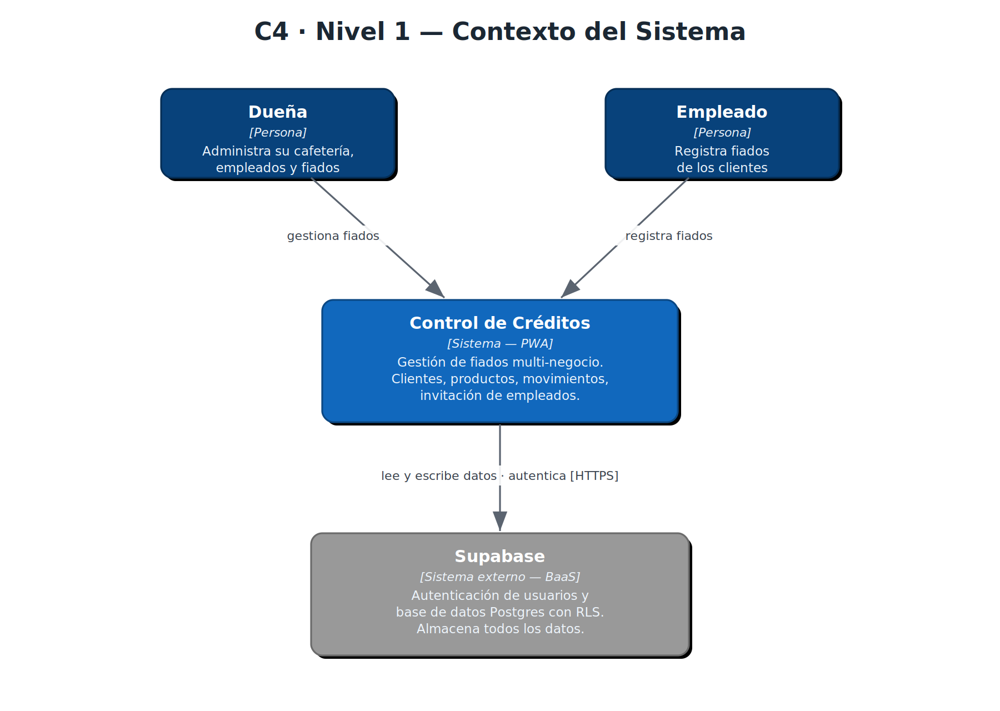
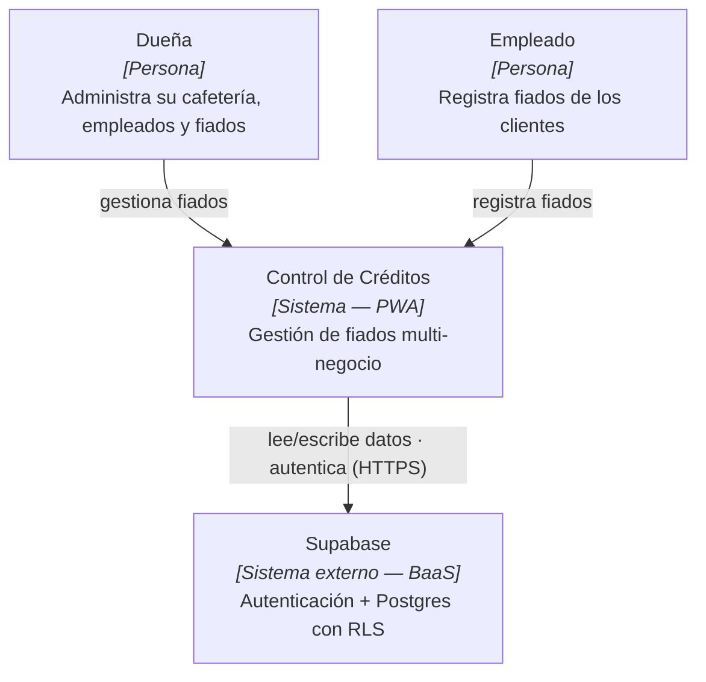
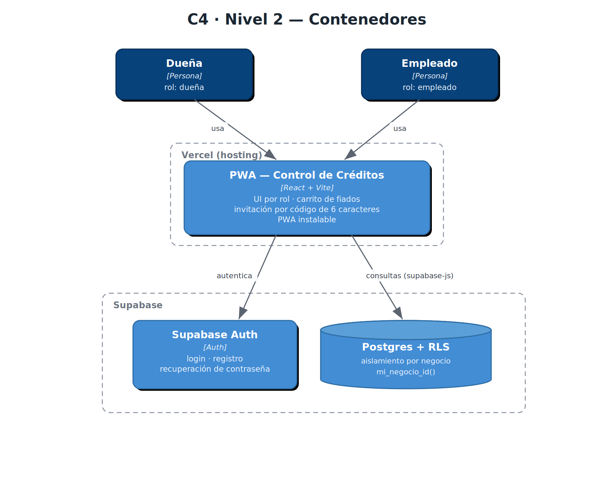
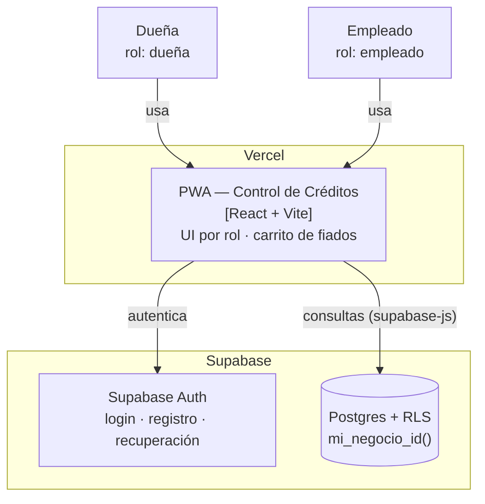
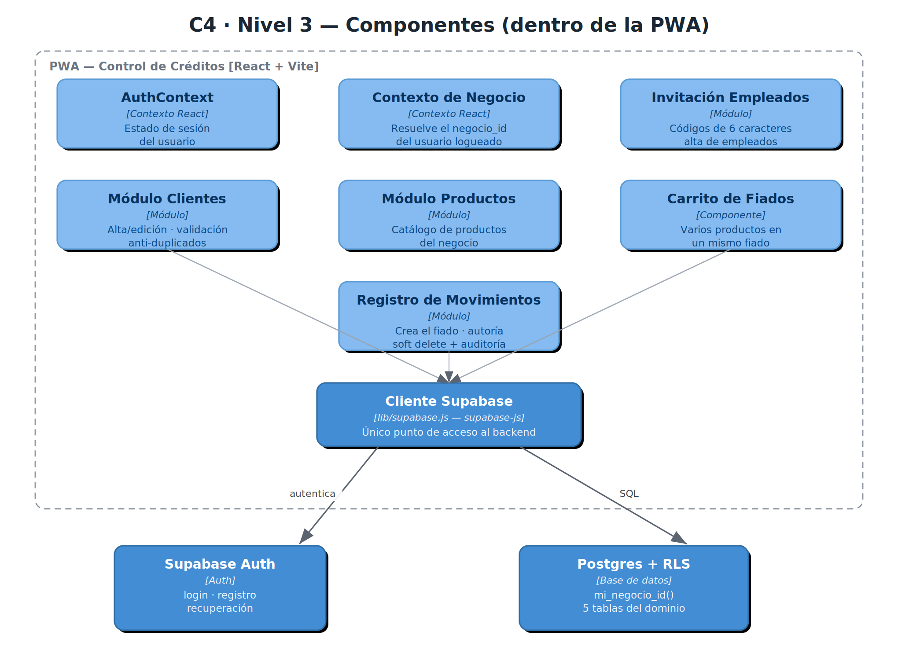
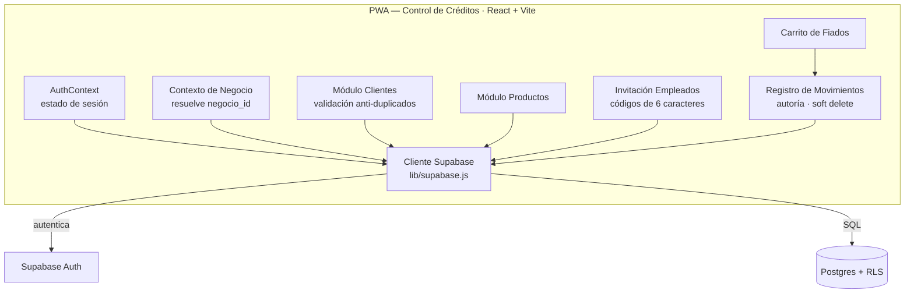
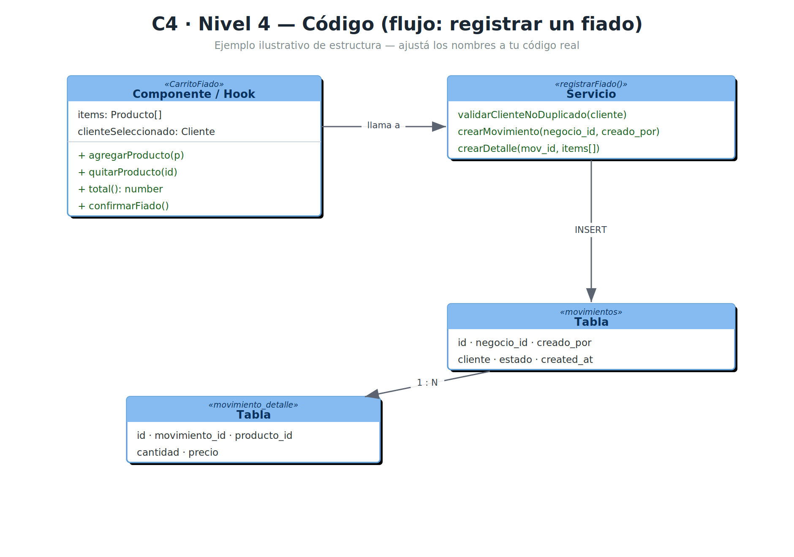
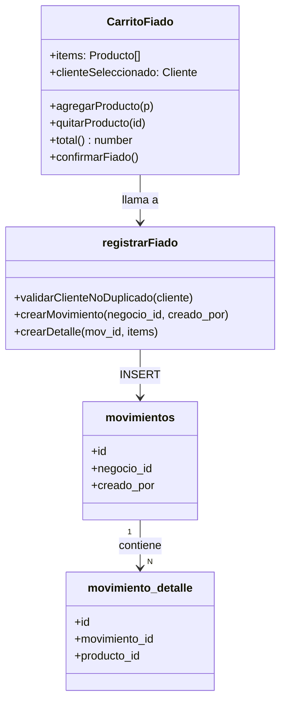
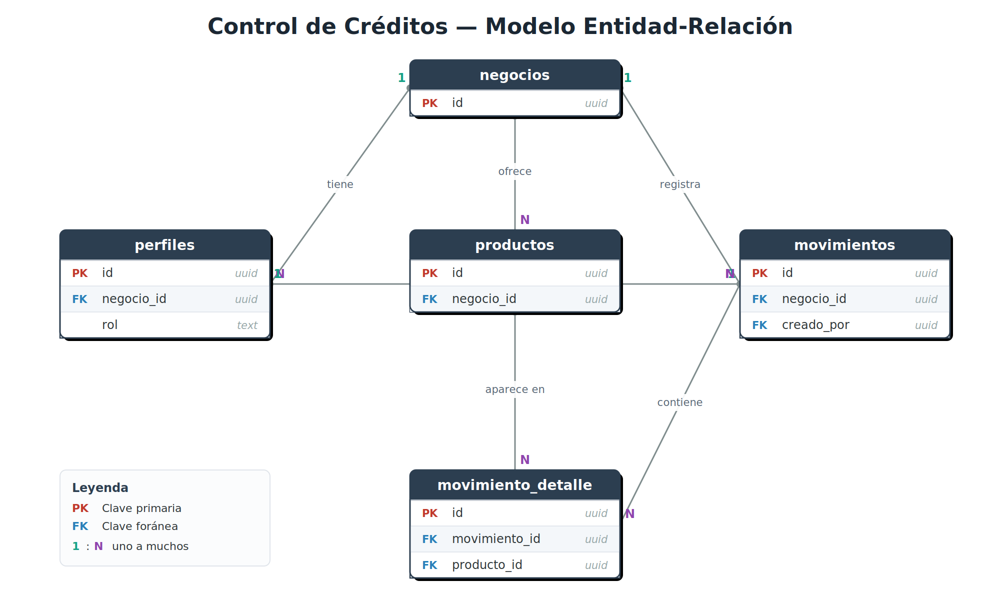
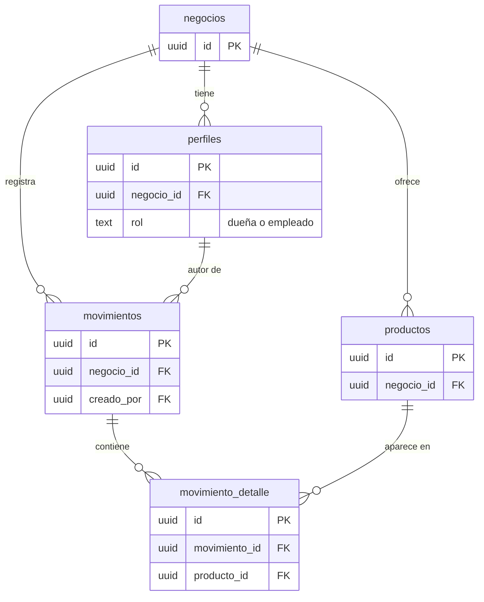

# Arquitectura — Control de Créditos (Cafetería Fiados)

PWA multi-tenant para gestión de fiados de una cafetería.
**Stack:** React + Vite (frontend) · Supabase (Auth + Postgres con RLS) · desplegado en Vercel.

---

## Sobre este documento

La arquitectura está documentada con el **modelo C4**, que describe un sistema en
cuatro niveles de zoom, del más lejano al más cercano:

| Nivel | Nombre | Qué muestra | Para quién |
|-------|--------|-------------|------------|
| 1 | Contexto | El sistema visto desde afuera y con quién habla | Cualquiera |
| 2 | Contenedores | Las piezas ejecutables grandes (app, auth, BD) | Técnicos |
| 3 | Componentes | El interior de una pieza (la PWA) | Desarrolladores |
| 4 | Código | Cómo se estructura un flujo concreto | Desarrolladores |

> **C4** es el *modelo* (qué mostrar y en qué niveles). **Mermaid** es la *herramienta*
> con la que están dibujados (texto que GitHub convierte en imagen). No son lo mismo:
> un diagrama puede ser "C4 dibujado en Mermaid".

Cada nivel abajo incluye la imagen y, en un bloque plegable, el código Mermaid editable.

> **Nota de confiabilidad:** los niveles **1 y 2** salen de la arquitectura real.
> Los niveles **3 y 4** están **inferidos de las funcionalidades** y deben ajustarse
> a los nombres y la estructura reales del código.

---

## Nivel 1 — Contexto

El sistema completo visto desde afuera: quién lo usa y de qué depende.

Código Mermaid (editable)

---

## Nivel 2 — Contenedores

Las piezas ejecutables grandes y cómo se comunican.

Código Mermaid (editable)

---

## Nivel 3 — Componentes (dentro de la PWA)

Zoom al interior de la PWA: sus módulos internos y el único punto de salida al backend.
**Inferido de las funcionalidades — ajustar a los archivos reales.**

Código Mermaid (editable)

---

## Nivel 4 — Código (flujo: registrar un fiado)

El nivel más cercano: cómo podría estructurarse un flujo concreto en clases/funciones
y qué tablas toca. **Ejemplo ilustrativo — este nivel rara vez refleja el código exacto.**

Código Mermaid (editable)

---

## Modelo Entidad-Relación (base de datos)

Relaciones entre las tablas principales. **Revisá las columnas contra tu esquema real.**

Código Mermaid (editable)

---

## Notas de seguridad (multi-tenancy)

- El aislamiento entre negocios se hace con **Row Level Security (RLS)** y la función `mi_negocio_id()`.
- La lectura de `perfiles` para movimientos de otros usuarios se resolvió con una función
  `security definer` + política que permite leer perfiles del mismo `negocio_id`.
- La creación de usuarios se hace en una **Edge Function** (`crear-usuario`) que usa la
  `service_role key` desde variables de entorno del servidor — nunca en el frontend.
